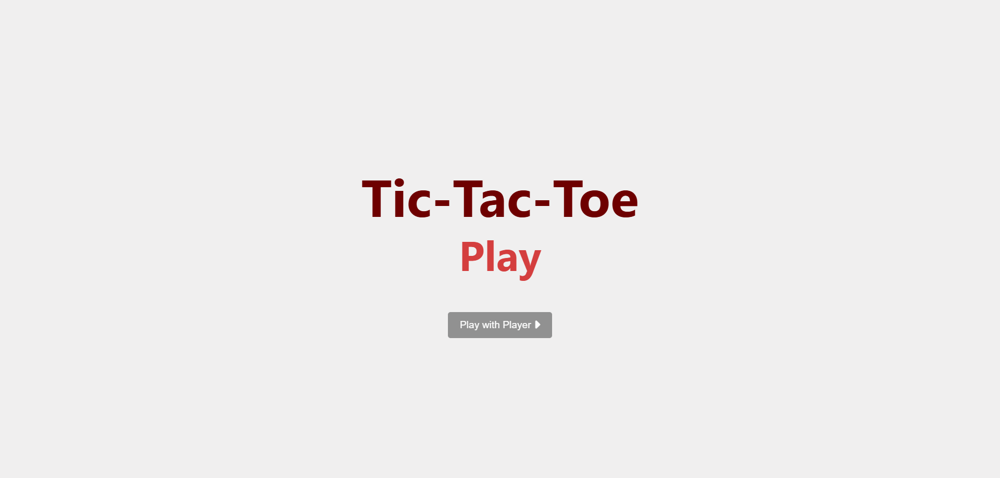
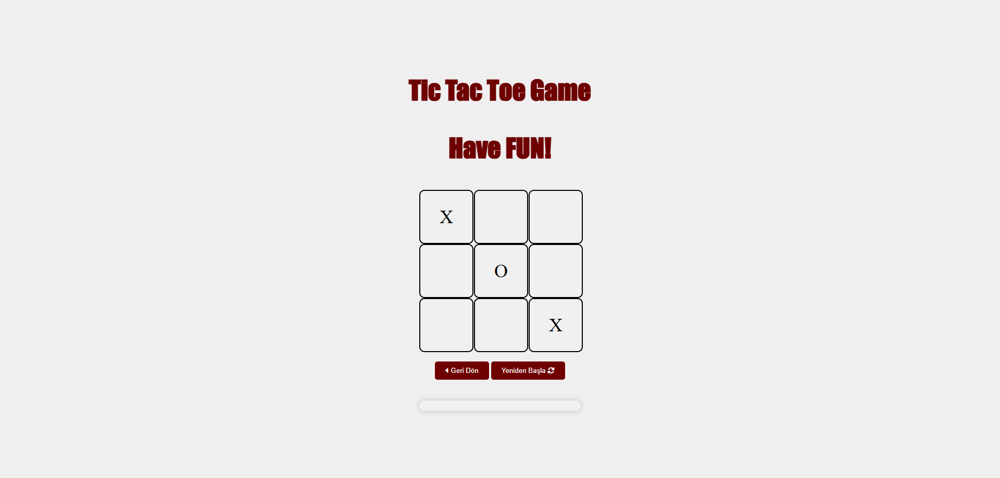

# ❌⭕ Tic-Tac-Toe Game (JavaScript)

**Tic-Tac-Toe-Javascript** is a simple web-based implementation of the classic Tic-Tac-Toe game. Built with vanilla JavaScript, HTML, and CSS, it provides a fun and interactive user experience.

---

## 🎯 Purpose

- Create a functional Tic-Tac-Toe game using only JavaScript, HTML, and CSS
- Practice DOM manipulation and game logic
- Offer an interactive, browser-based mini game

---

## 🚀 Features

- 🕹️ **2-Player Game**: Play against a friend in the same browser
- 🔁 **Restart Functionality**: Reset the board to play again
- 💡 **Turn Indicator**: Displays which player's turn it is
- 🎉 **Win Detection**: Identifies winning combinations and declares the winner

---

## 🛠️ Tech Stack

| Layer         | Technologies         |
|---------------|----------------------|
| Frontend      | HTML, CSS, JavaScript |
| Tools         | Git, GitHub, VS Code |

---





---
## 📦 Getting Started

Clone the repository and open the `home.html` file in your browser:


```bash
git clone https://github.com/kuyucucaner/Tic-Tac-Toe-Javascript.git
cd Tic-Tac-Toe-Javascript
